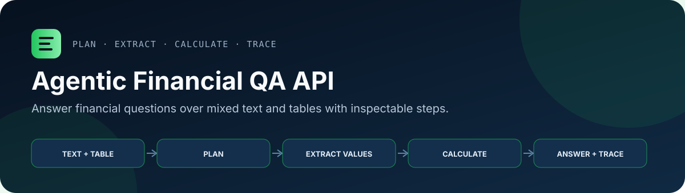
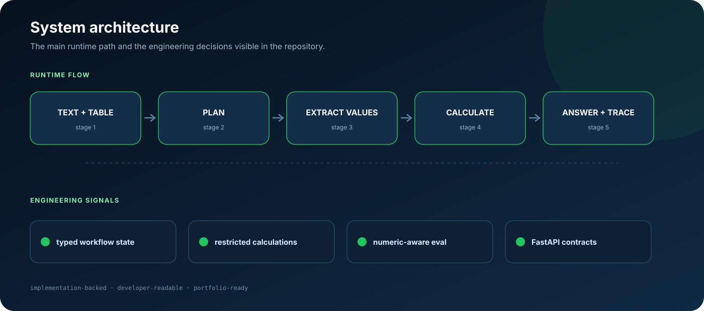

<p align="center">
  
</p>

<p align="center">
  
  
  
</p>

<p align="center">
  <a href="#local-setup">Local setup</a> ·
  <a href="#architecture">Architecture</a> ·
  <a href="#review-guide">Review guide</a>
</p>

FastAPI service for answering financial questions over mixed text and table inputs. The system uses a LangGraph workflow to decompose financial QA into planning, data extraction, calculation, and answer generation, while preserving intermediate steps for traceability.

This project is based on ConvFinQA-style tasks: questions often require locating values across financial narrative text and tables, applying multi-step arithmetic, and formatting the final answer in a finance-appropriate way.

## At a Glance

| Area | Implementation signal |
| --- | --- |
| Product problem | Turn financial narrative + table inputs into traceable numeric answers. |
| Agent workflow | LangGraph stages for planning, extraction, calculation, and final response generation. |
| API layer | FastAPI endpoint with typed Pydantic request/response contracts. |
| Evaluation | Batch runner with exact-match, numeric precision, and scale-aware tolerance metrics. |
| FDE relevance | Converts an ambiguous domain workflow into an inspectable, API-backed system with clear failure surfaces. |

## Why This Project

Financial QA is a useful test bed for applied LLM systems because the answer is rarely just a paragraph lookup. A reliable system needs to:

- understand the user's question and derive the required calculation;
- extract numeric values from semi-structured text and tables;
- execute calculations consistently;
- explain or expose the reasoning path; and
- evaluate outputs with numeric-aware metrics rather than only string matching.

This repository demonstrates that workflow as an API-backed agentic system.

## Architecture

<p align="center">
  
</p>

## Core Workflow

```text
START
  -> create_solution_plan
  -> extract_data
  -> perform_calculations
  -> generate_answer
END
```

The workflow is implemented with LangGraph and a typed state object (`FinQAState`). Each stage updates the shared state with structured artifacts:

- `solution_plan`: variables to extract, formulas to execute, and context metadata;
- `variables`: extracted values and calculated results;
- `steps`: trace events for planning, extraction, validation, calculation, and answer generation;
- `answer`: final formatted response;
- `error`: workflow-level failure details when a stage cannot complete.

## Architecture Highlights

- FastAPI service layer with a dedicated `/financial-qa/questions` endpoint.
- LangGraph state machine for explicit, inspectable workflow orchestration.
- LLM-based planning and extraction for messy financial text/table inputs.
- Restricted calculation environment for executing model-generated arithmetic expressions.
- Step-level trace output so the caller can inspect how a number was derived.
- Batch inference script for running examples from the ConvFinQA dataset.
- Evaluation helpers for exact match, precision-aware numeric comparison, and scale-aware tolerance matching.

## Review Guide

If you are scanning this repository, the most relevant implementation areas are:

- `agentic_financial_qa/core/workflow.py`: LangGraph workflow, typed state, planning/extraction/calculation stages, and trace generation.
- `agentic_financial_qa/api/models.py`: Pydantic request/response contracts for mixed financial text/table inputs.
- `agentic_financial_qa/api/routes.py`: FastAPI boundary and error handling around the agentic workflow.
- `scripts/batch_inference_eval_finqa.py`: dataset runner and numeric-aware evaluation metrics.
- `tests/test_api.py`: lightweight API contract checks that do not require an OpenAI key.

## API Surface

### `POST /financial-qa/questions`

Request:

```json
{
  "question": "What was the percentage change in operating income between 2017 and 2018?",
  "pre_text": [
    "Financial Highlights ($ in millions except per share amounts)"
  ],
  "post_text": [
    "Operating income increased primarily due to growth across business segments."
  ],
  "table": [
    ["Year", "2016", "2017", "2018"],
    ["Revenue", "91,154", "110,360", "125,843"],
    ["Operating Income", "26,147", "34,576", "39,240"]
  ]
}
```

Response:

```json
{
  "answer": "13.5%",
  "steps": [
    {
      "op": "plan",
      "arg1": "What was the percentage change in operating income between 2017 and 2018?",
      "arg2": "",
      "res": "solution_plan_created"
    },
    {
      "op": "extract",
      "arg1": "income_2017",
      "arg2": "table",
      "res": "34576"
    },
    {
      "op": "extract",
      "arg1": "income_2018",
      "arg2": "table",
      "res": "39240"
    },
    {
      "op": "percentage_change",
      "arg1": "income_2018",
      "arg2": "income_2017",
      "res": "13.5"
    },
    {
      "op": "answer",
      "arg1": "final_result",
      "arg2": "",
      "res": "13.5%"
    }
  ],
  "variables": {
    "income_2017": 34576,
    "income_2018": 39240,
    "percentage_change": 13.5
  }
}
```

### `GET /health`

```json
{
  "status": "healthy",
  "service": "Financial QA API"
}
```

## Local Setup

This project uses Poetry.

```bash
poetry install
```

Create a local `.env` file:

```env
OPENAI_API_KEY=...
FINQA_OPENAI_MODEL=gpt-4o
```

You can also copy `.env.example` and fill in your local key. Health checks and OpenAPI docs load without an API key; only the inference endpoint requires `OPENAI_API_KEY`.

Run the API:

```bash
poetry run python server.py
```

Or specify host and port:

```bash
poetry run python server.py --host 127.0.0.1 --port 8000
```

Open the API docs:

```text
http://127.0.0.1:8000/docs
```

Run local tests:

```bash
poetry run pytest -q
```

## Batch Evaluation

The repository includes a ConvFinQA batch evaluation script:

```bash
poetry run python scripts/batch_inference_eval_finqa.py --num_examples 10
poetry run python scripts/batch_inference_eval_finqa.py --output evaluation_results.json
```

The evaluator reports complementary metrics:

- exact match after answer normalization;
- precision-aware numeric matching for decimal-format differences;
- scale-aware tolerance matching for financial values with different magnitudes.

Generated evaluation output is intentionally ignored by git so the repository stays focused on source code and reproducible tooling rather than one-off run artifacts.

## Project Structure

```text
.
├── server.py                         API server entry point
├── agentic_financial_qa/
│   ├── main.py                       FastAPI app definition
│   ├── api/
│   │   ├── models.py                 Pydantic request/response models
│   │   └── routes.py                 API routes
│   └── core/
│       └── workflow.py               LangGraph financial QA workflow
├── scripts/
│   └── batch_inference_eval_finqa.py Batch inference and evaluation
└── tests/
    └── test_api.py                   Basic API tests
```

## Portfolio Positioning

This is a prototype for agentic financial reasoning, not a production financial-advice system. The strongest signals are the workflow decomposition, typed state management, traceable intermediate steps, API packaging, and evaluation discipline around numeric answers.

For FDE-style work, the relevant takeaway is the ability to translate an ambiguous domain problem into a working technical system: define the state model, split the workflow into inspectable stages, expose it through an API, and build evaluation hooks for iterative improvement.
